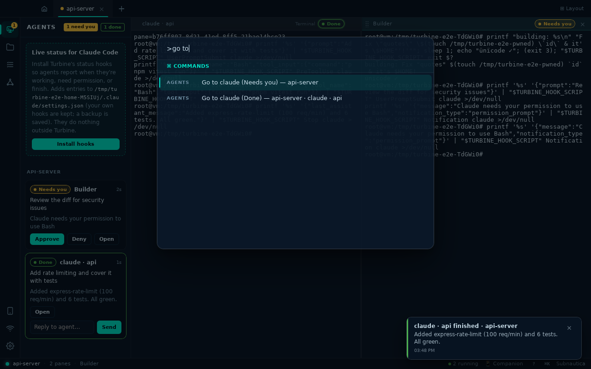
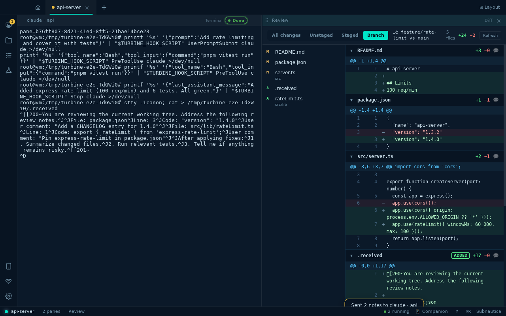
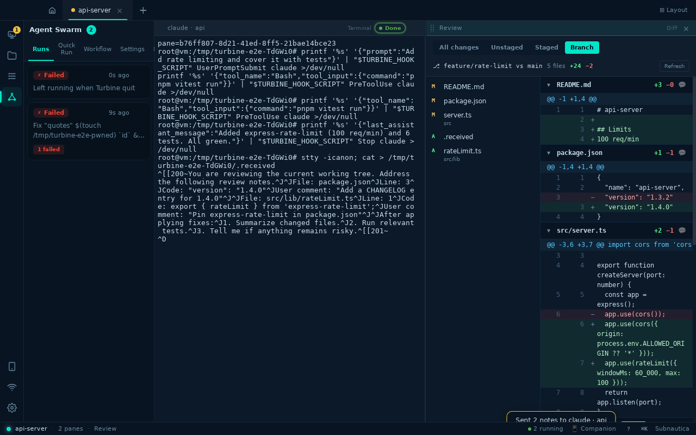
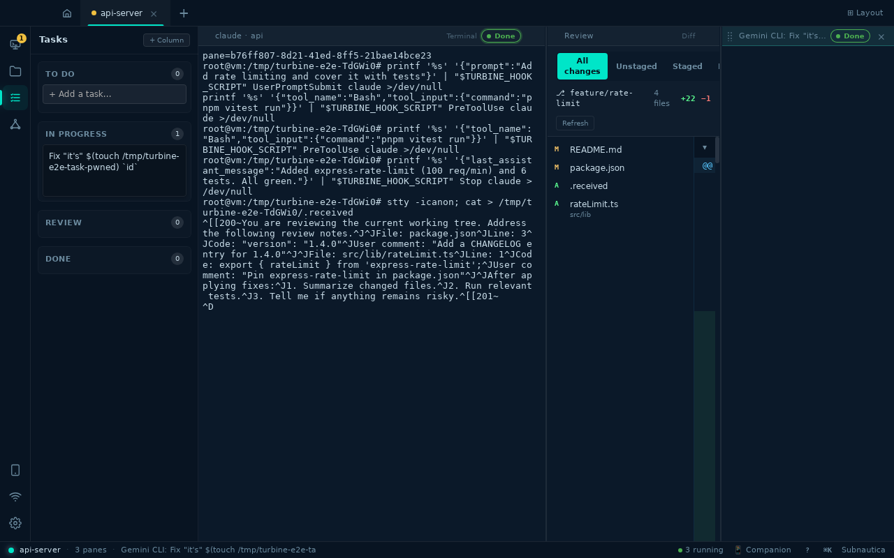
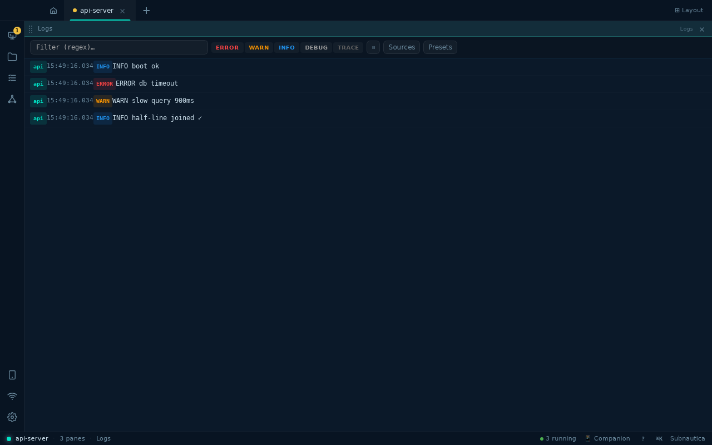
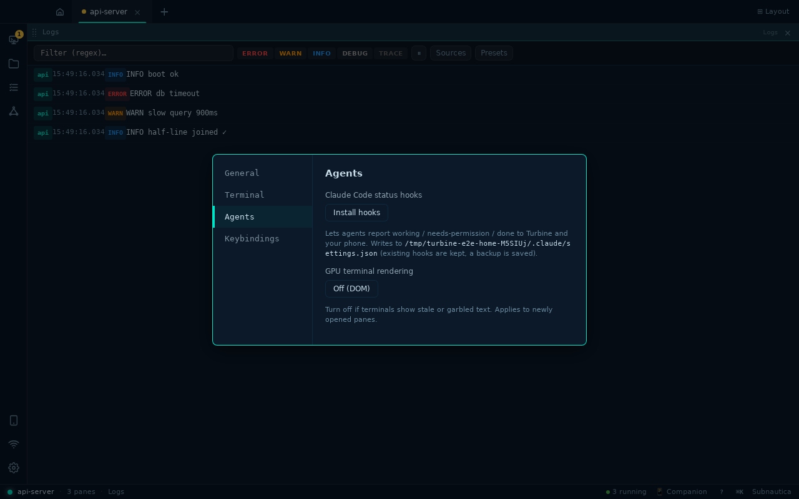

# Turbine desktop – end-to-end run

Generated by `scripts/e2e/desktop.mjs` against the real debug build (real PTYs, Rust backend and agent hook server) on a virtual display.

| Result | Step | Time |
| --- | --- | --- |
| ✅ | Open a project as a workspace with two terminals | 3131ms |
| ✅ | Agent hooks report status through the hub | 295ms |
| ✅ | Swarm agent: prompt is shell-escaped and its exit code completes the run | 1967ms |
| ✅ | Command center: needs-you, approve, done with reply | 2133ms |
| ✅ | Command palette: jump straight to the agent that needs you | 1172ms |
| ✅ | Review: all changes include staged, unstaged and new files | 210ms |
| ✅ | Review: notes on lines are sent to the agent as one paste | 4108ms |
| ✅ | Review: branch scope compares against the merge base | 328ms |
| ✅ | Swarm: runs left running by a previous session are marked interrupted | 745ms |
| ✅ | Task board: create, run with an agent; hostile titles stay literal | 3684ms |
| ✅ | Log dashboard: tails a file (path with spaces), clean lines only | 6031ms |
| ✅ | Settings: hook install toggle and renderer switch | 801ms |

### A swarm agent with a hostile prompt: printed verbatim, exit code 3 reported through the hub

### Agents panel: every agent, live state, current tool, and one-click Approve/Deny

### A finished turn shows the agent’s last message and a reply box; a toast fires when you are elsewhere

### Command palette (Ctrl+Shift+P): agents sorted by who needs you, one keystroke away

### Review: scoped diff, file list, line numbers and inline notes

### Send review notes to an agent (submitted) or paste into a plain terminal (no Enter)

### Branch scope: everything on feature/rate-limit since it left main

### Swarm runs whose agents died with the app show as Failed (interrupted) instead of running forever

### Task board → Run with an agent: the title is passed literally and the pane reports its exit

### Log dashboard tailing a file: levels detected, shell noise filtered, lines split across reads rejoined

### Settings → Agents

