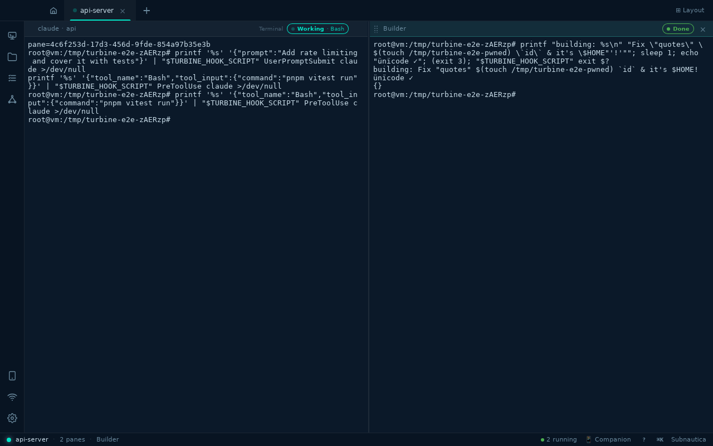
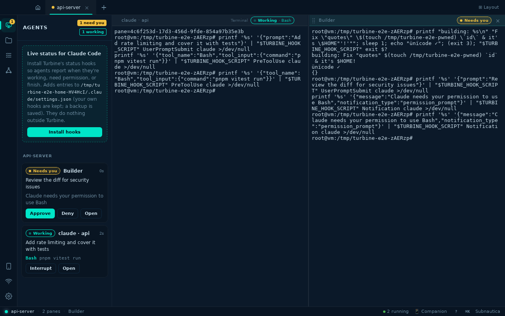
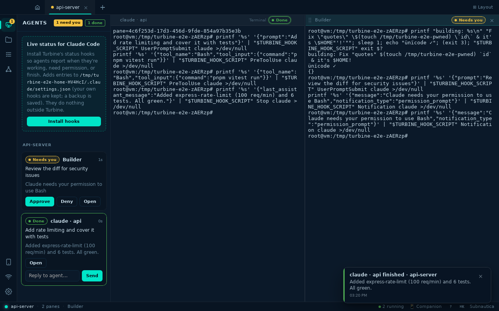
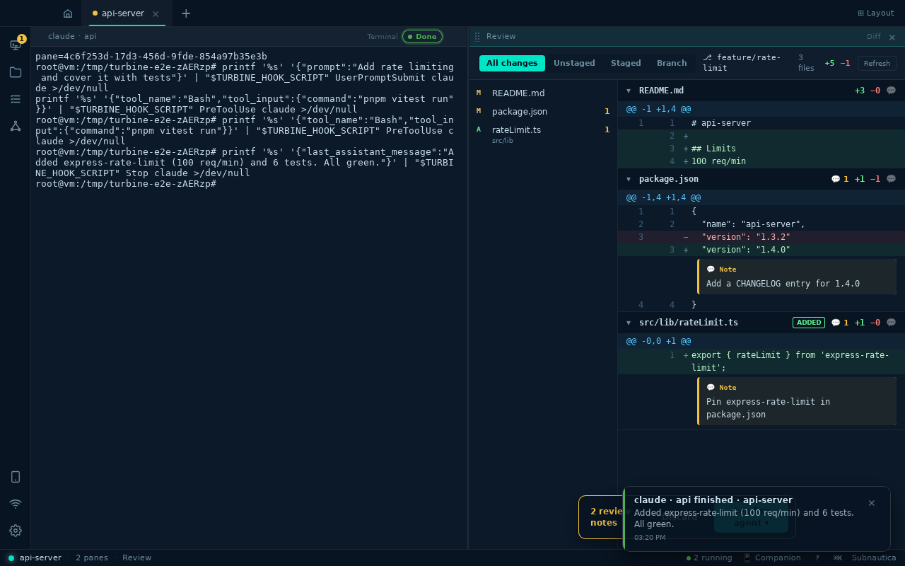
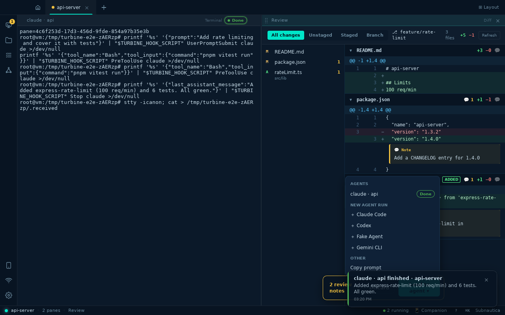
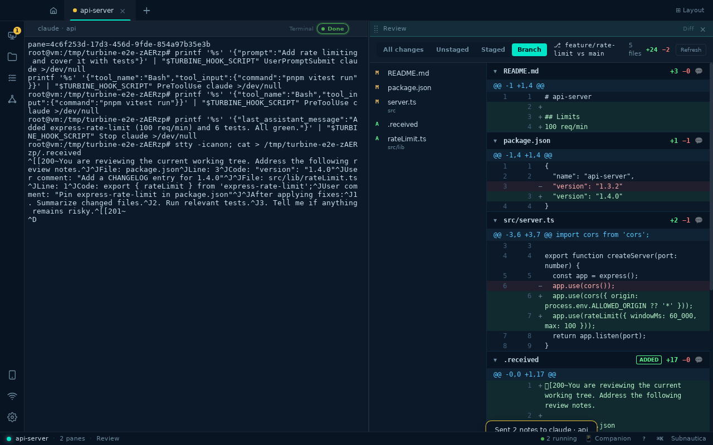
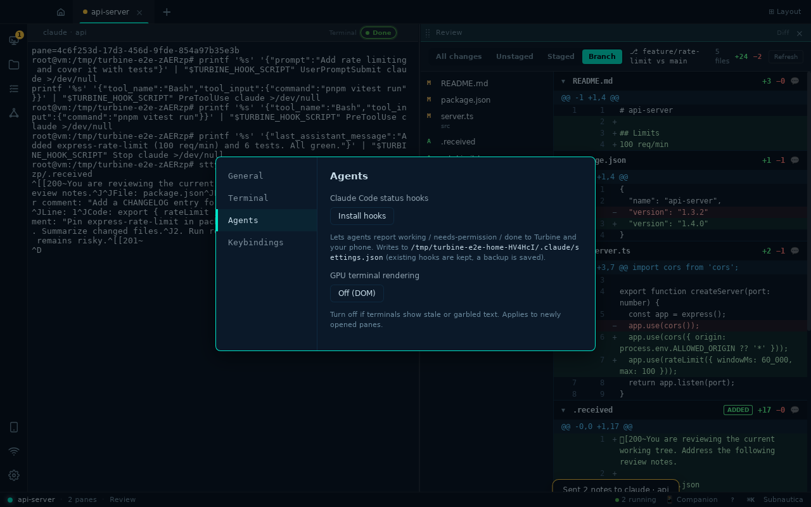

# Turbine desktop – end-to-end run

Generated by `scripts/e2e/desktop.mjs` against the real debug build (real PTYs, Rust backend and agent hook server) on a virtual display.

| Result | Step | Time |
| --- | --- | --- |
| ✅ | Open a project as a workspace with two terminals | 3129ms |
| ✅ | Agent hooks report status through the hub | 62ms |
| ✅ | Swarm agent: prompt is shell-escaped and its exit code completes the run | 1973ms |
| ✅ | Command center: needs-you, approve, done with reply | 2124ms |
| ✅ | Review: all changes include staged, unstaged and new files | 211ms |
| ✅ | Review: notes on lines are sent to the agent as one paste | 4138ms |
| ✅ | Review: branch scope compares against the merge base | 321ms |
| ✅ | Settings: hook install toggle and renderer switch | 830ms |

### A swarm agent with a hostile prompt: printed verbatim, exit code 3 reported through the hub

### Agents panel: every agent, live state, current tool, and one-click Approve/Deny

### A finished turn shows the agent’s last message and a reply box; a toast fires when you are elsewhere

### Review: scoped diff, file list, line numbers and inline notes

### Send review notes to an agent (submitted) or paste into a plain terminal (no Enter)

### Branch scope: everything on feature/rate-limit since it left main

### Settings → Agents

